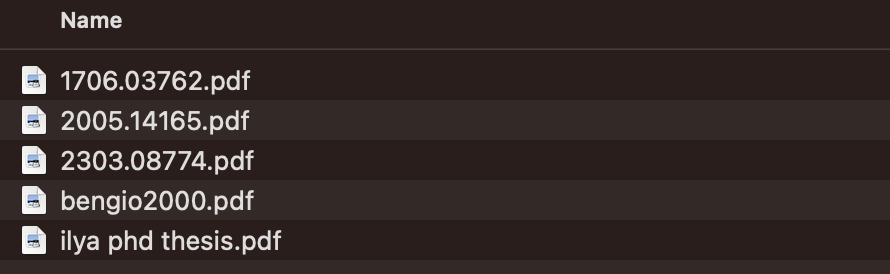
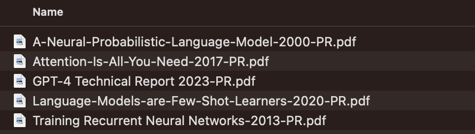

# pdfrename - *say goodbye to `ed1d47.pdf`!*

A simple python script to **rename *research PDF* files based on their content**.

Leverages [pdfminer](https://github.com/pdfminer/pdfminer.six) to extract text and [GPT](https://openai.com) to generate the filename.

### Before



### After running pdfrename



## FAQ

*Why not use the Title from the PDF metadata? Because it's often missing: in my personal collection of research papers, only 44% of the PDFs have a Title metadata field.*

*Isn't this expensive? In my personal collection of research papers, renaming each PDF uses ~2.1K tokens on average. At `gpt-3.5-turbo-0125` current cost of $0.0005 / 1K tokens, that means renaming each PDF costs ~$0.001 (1 tenth of a penny). I think it's worth it!*

*Why does it add -PR.pdf to the end of filenames? Since the cost is non-zero to rename files, pdfrename needs to keep track of files which have already been renamed to avoid renaming again. I wanted something simpler than having to store a db, using filesystem attributes, or storing additional metadata files. I settled on using this suffix (-PR for (P)DF (R)ename) as a marker for renamed files.*

## Usage

Set your OpenAI API key in `pdfrename.py`:
```python
openai.api_key = "YOUROPENAIKEY"
```

Then run:

```bash
pip install -r requirements.txt
python pdfrename.py filetorename.pdf
```

To run recursively on a directory:

```bash
find whichdirectory -name "*.pdf" | parallel -j 10 python pdfrename.py 
```

## Monitoring a folder on MacOS


In the `folderaction.workflow` directory there is a MacOS Automator workflow that can be used to monitor a folder for new pdfs and automatically rename them. 

Change `PATHTOCODE` in `folderaction.workflow/document.wflow` to point to the location of the `pdfrename.py` script:

```xml
<key>ActionParameters</key>
				<dict>
					<key>COMMAND_STRING</key>
					<string>for f in "$@"
do
	if [[ -d "$f" ]]; then
		continue
	fi
	python PATHTOCODE/pdfrename.py "$f"
done</string>
```

To install, copy the `folderaction.workflow` to `~/Library/Workflows/Applications/Folder Actions` and then right click on a folder in Finder and select `Services -> Folder Actions Setup...` and then select the `folderaction.workflow` from the list of available workflows.


## License

Copyright (c) 2024 Salle, Alexandre alex@alexsalle.com. All work in this package is distributed under the MIT License.
